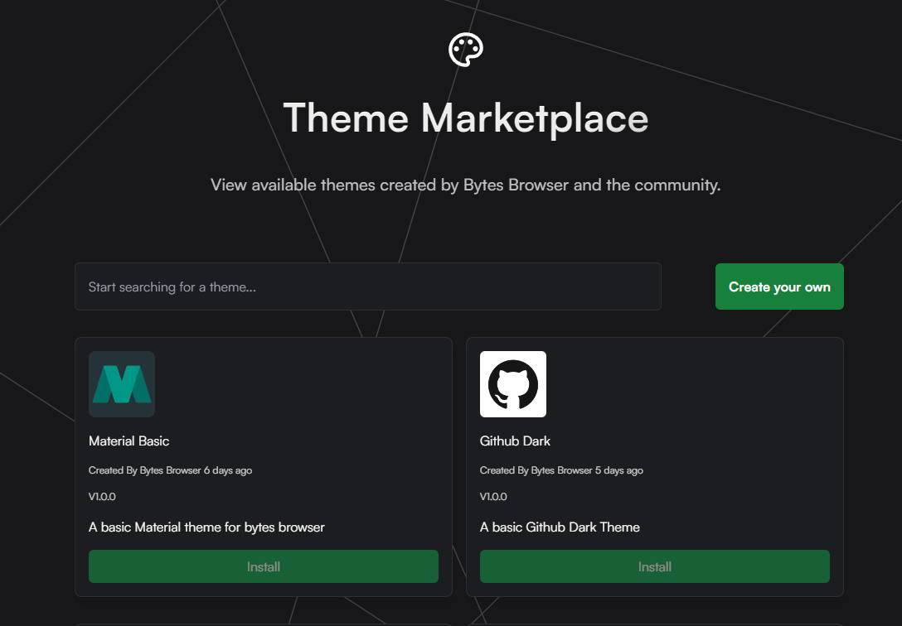

# Creating A Theme

Follow the steps below to create a theme.

:::tip

Creating a theme requires a [Bytes Browser Pro](https://bytesbrowser.com) account before continuing.

:::

---

1. Head to the [`Themes`](https://bytesbrowser.com/marketplace/themes) section in the [`Marketplace`](https://bytesbrowser.com/marketplace) and click on the `Create Theme` button.

2. Enter the name of the theme in the `Name` field.

3. Enter a short description of the theme in the `Description` field.

4. Enter the content of the theme in the `Content` field. You can learn more about the theme content [here](/Theming/ThemeContent). Although our online tool makes it much easier to build themes without having to write any code.

5. Upload an icon for the theme in the `Icon` field. (Optional)

6. Enter the version of the theme in the `Version` field. (Ex. 1.0.0)

7. Click on the `Create` button.
