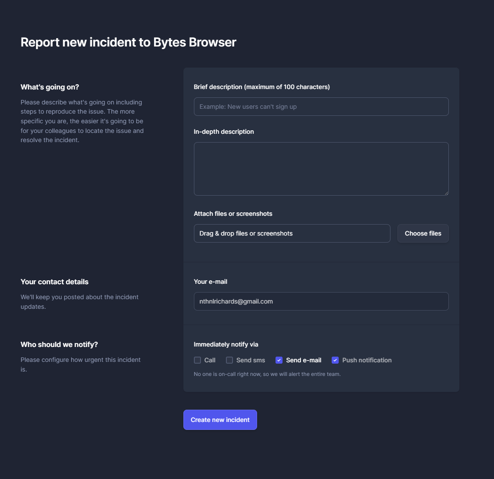

# Overview

## Release Schedule

Bytes Browser is currently in Alpha and has no promised release schedule. We will release updates as soon as they are ready. Once the public beta is released, we will follow a monthly release schedule, scheduled, and announced in advance.

## Versioning

Bytes Browser follows the [Semantic Versioning](https://semver.org/) guidelines. The version number is in the format `x.x.x` where `x` is a number. The version number is incremented as follows:

- **Major**: When there are breaking changes.
- **Minor**: When new features are added.
- **Patch**: When there are bug fixes.

## Changelog

The changelog is a log or record of all notable changes made to Bytes Browser. The changelog is updated with every release. You can view the changelog [here](/changelog/Overview). The changelog is also available in the app.

## Reporting Bugs & Requesting Features

To report a bug or request a feature, you can use the `?` button in the app or head to the [`Issues`](https://github.com/bytesbrowser/bytes-browser-releases/issues/new) section in the [`bytes-browser-releases`](https://github.com/bytesbrowser/bytes-browser-releases/tree/1.0.1) repository.

## Support

:::info

We have a dedicated support site planned for early beta releases that will be located at [support.bytesbrowser.com](https://support.bytesbrowser.com) where you can get help with Bytes Browser, report bugs, get help with your account, and more.

:::

For general support the best way to reach us is on our status page at [status.bytesbrowser.com](https://status.bytesbrowser.com) or on our [Discord](https://discord.com/invite/btR3pj8TNM) server.

> For now we are using this system however as we grow we will be moving to a dedicated support site.
