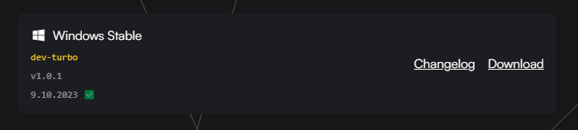

# Tags

Tags are used to categorize releases. Release tags are used to semantically identify releases and for whom they are intended. Tags are used to identify the type of release, the intended audience, and the release status.

## Release Type

There are currently two release types: `Stable` and `Beta`. The `Stable` release type is used for releases that are intended for production use. The `Beta` release type is used for releases that are intended for testing and feedback. You can see this present in the above image where the release title is Windows **Stable**

### Stable

- Stable releases are intended for production use.
- Stable releases are considered to be stable and ready for production use.
- Stable releases are considered to be feature complete and are not expected to change in a way that would break compatibility with existing code.

#### Who should use Stable releases?

- Users who want to use the latest features.
- Users who want to use the latest bug fixes.
- Users who want to use the latest security fixes.

### Beta

- Beta releases are intended for testing and feedback.
- Beta releases are considered to be stable and ready for testing and feedback.
- Beta releases are considered to be feature complete and are not expected to change in a way that would break compatibility with existing code.

#### Who should use Beta releases?

- Users who want to test new features and provide feedback.
- Users who want to test bug fixes and provide feedback.
- Users who want to test security fixes and provide feedback.
- Users who are okay with using potentially unstable software.

## Release Audience

There are currently three release audiences: `dev`, `public`, and `supporter`. The `dev` release audience is used for releases that are intended for developers. The `public` release audience is used for releases that are intended for the general public. The `supporter` release audience is used for releases that are intended for supporters first but will be made available to the general public at a later date.

### Release Channel

There are currently three release channels: `snail`, and `turbo`. The `turbo` release channel is used for releases that are intended for the general public and are approved as stable and ready for production use.

The `snail` release channel is used for releases that are intended for the general public and are approved as stable and ready for production use but are not yet available to the general public.
