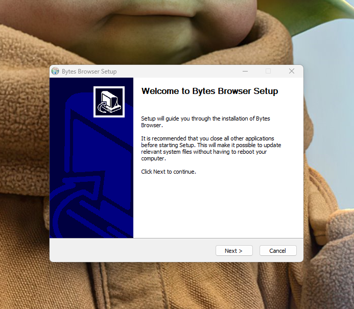

import Tabs from '@theme/Tabs';
import TabItem from '@theme/TabItem';

# Setup Bytes Browser

Let's setup **Bytes Browser in less than 5 minutes**.

## Getting Started

### Installation

Download the latest version of Bytes Browser from the [downloads page](https://bytesbrowser.com/downloads) at any time. Bytes Browser will be available for Windows, macOS, and Linux Bytes Browser is currently in Alpha and is not yet available for macOS and Linux. We are working hard to bring it to you as soon as possible.

To install Bytes Browser, simply run the downloaded installer and follow the instructions.



:::info

**Note:** This will be the only time you need to download Bytes Browser. Bytes Browser will automatically update itself when a new version is available.

<!-- Get started by **creating a new site**.

Or **try Docusaurus immediately** with **[docusaurus.new](https://docusaurus.new)**.

### What you'll need

- [Node.js](https://nodejs.org/en/download/) version 16.14 or above:
  - When installing Node.js, you are recommended to check all checkboxes related to dependencies.

## Generate a new site

Generate a new Docusaurus site using the **classic template**.

The classic template will automatically be added to your project after you run the command:

```bash
npm init docusaurus@latest my-website classic
```

You can type this command into Command Prompt, Powershell, Terminal, or any other integrated terminal of your code editor.

The command also installs all necessary dependencies you need to run Docusaurus.

## Start your site

Run the development server:

```bash
cd my-website
npm run start
```

The `cd` command changes the directory you're working with. In order to work with your newly created Docusaurus site, you'll need to navigate the terminal there.

The `npm run start` command builds your website locally and serves it through a development server, ready for you to view at http://localhost:3000/.

Open `docs/intro.md` (this page) and edit some lines: the site **reloads automatically** and displays your changes. -->
